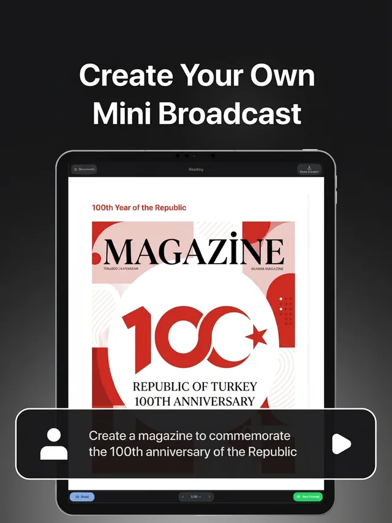
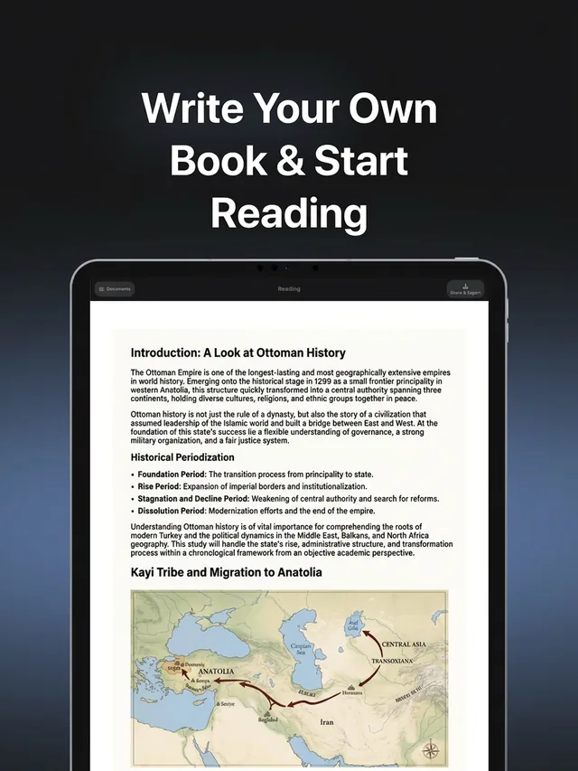
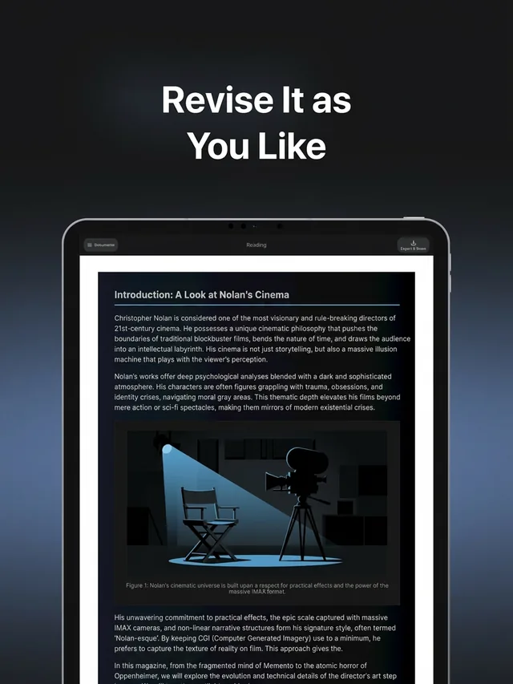

# Tasvir

### AI study guide, textbook and document generator — turn any PDF or topic into an illustrated, printable document of up to 50 pages.

Upload your lecture notes or type what you are studying, and Tasvir writes a long-form visual document — study guides, textbooks, academic reports, magazines and children's books. A planner agent decides the audience, page flow, theme and visuals *before* writing, so you get up to 50 paginated pages with images, tables, charts and diagrams instead of a wall of chat text. Every new account starts with 300 free credits — about five pages — and it works in any language.

 

*▲ Click to watch the 90-second demo*

## Live examples

> These open the real generated documents in Tasvir — no account needed. Each includes the **exact prompt** used, so you can copy it and try the same.

> Studying for the Turkish university exam? There is a separate catalogue of 83 TYT/AYT topic documents: **[Tasvir-YKS-Hazirlik](https://github.com/Tasvir-app/Tasvir-YKS-Hazirlik)** — browsable at **[tasvir.ai/tr/yks](https://tasvir.ai/tr/yks/)**.

<table>
  <tr>
    <td align="center" width="33%">
      
       <strong>Istanbul in 7 Days</strong>
    </td>
    <td align="center" width="33%">
      
       <strong>Black Holes</strong>
    </td>
    <td align="center" width="33%">
      
       <strong>Turkish Republic</strong>
    </td>
  </tr>
  <tr>
    <td align="center" width="33%">
      
       <strong>Human Body Atlas</strong>
    </td>
    <td align="center" width="33%">
      
       <strong>World of Dinosaurs</strong>
    </td>
    <td align="center" width="33%">
      
       <strong>Parabola Notes</strong>
    </td>
  </tr>
</table>

| Document | What it shows | Category |
|---|---|---|
| [7-Day Istanbul Discovery Guide](https://app.tasvir.ai/c/22a5f10672416b1334acf5424c81f76e635ef76444469093b95748ba0e36107c/1) | Day-by-day itinerary, neighbourhood budget tables, street-food maps | 🗺️ Travel |
| [Black Holes and Hawking Radiation](https://app.tasvir.ai/c/636b871fcbc9f3dd44f2b66f8523d0ebe3b5839c764e1dffedb0cf9049ce5460/1) | Dark-theme popular science, astrophysics renders, Schwarzschild maths | 🔬 Science |
| [100th Anniversary of the Turkish Republic](https://app.tasvir.ai/c/280d3ec831eb7728c4a47b62edc73a4f5125f53258ae398ee2dfc465b017f60a/1) | Editorial magazine, historical timeline, charts | 📜 History |
| [Human Body Atlas](https://app.tasvir.ai/c/0a452cf58022c0d1482da8402a3f9791f833c7c9278df985df2f063822728a2c/1) | Circulatory, nervous, digestive, skeletal, muscular, respiratory systems | 🧒 Kids |
| [A Day in the World of Dinosaurs](https://app.tasvir.ai/c/cd489ef1a4623172dad283b4b3824d0fb570004d1975f70626dbb69db1389300/1) | Illustrated kids' book with size comparisons and habitat maps | 🧒 Kids |
| [Parabola Notes — Advanced Math](https://app.tasvir.ai/c/565874419d853973ac8ad491c7655b67500cefdc3fbe36753c862db1a8589664/1) | Parabola drawings + LaTeX-style formula layout | 📐 Exam prep |

<b>📚 See all example documents (by category)</b>

 

**🎬 Film & Gaming**
- [The Matrix Universe Guide](https://app.tasvir.ai/c/c2e7f526d16f9d0ecc0cddd66367466c92a91530407281d2223e34f5e60eddc2/1)
- [Inception Universe](https://app.tasvir.ai/c/56eb70636ffbe34864ee3c0d48d5a1416ffbadc66e79bf1188f28ad5189ff1df/1)
- [Half-Life Universe and Story](https://app.tasvir.ai/c/20b80d4849f42fd45c29e21428f94080b5682585f0eb7bd17ecfadb1b370dabb/1)

**📜 History**
- [100th Anniversary of the Turkish Republic](https://app.tasvir.ai/c/280d3ec831eb7728c4a47b62edc73a4f5125f53258ae398ee2dfc465b017f60a/1)
- [The Roman Empire](https://app.tasvir.ai/c/bc2e862449bacbeefdc250f590d9bc6c0d612b68bf33e8e78bac5c9044ac73ce/1)

**🗺️ Travel**
- [7-Day Istanbul Discovery Guide](https://app.tasvir.ai/c/22a5f10672416b1334acf5424c81f76e635ef76444469093b95748ba0e36107c/1)

**🔬 Science & Technical**
- [Black Holes and Hawking Radiation](https://app.tasvir.ai/c/636b871fcbc9f3dd44f2b66f8523d0ebe3b5839c764e1dffedb0cf9049ce5460/1)
- [Machine Learning and Gradient Descent](https://app.tasvir.ai/c/50d6b8b64239986c8ea156f99660d6e56efb1e9f0ab14722ceca4e8040ec9830/1)

**📐 Math & Exam Prep**
- [Parabola Notes — Advanced Math](https://app.tasvir.ai/c/565874419d853973ac8ad491c7655b67500cefdc3fbe36753c862db1a8589664/1)
- [Analytic Geometry of the Line](https://app.tasvir.ai/c/4c7fd571f7dfb2b7d8ab36c1b23fd181e3b4415aad3361fd4cd5779893dbc693/1)
- [IELTS Exam Preparation Guide](https://app.tasvir.ai/c/c8799822e2f6702502072cdb49cbd275c9241f26104ca9ed532852067ce11901/1)

**🧒 Kids & Family**
- [Human Body Atlas](https://app.tasvir.ai/c/0a452cf58022c0d1482da8402a3f9791f833c7c9278df985df2f063822728a2c/1)
- [A Day in the World of Dinosaurs](https://app.tasvir.ai/c/cd489ef1a4623172dad283b4b3824d0fb570004d1975f70626dbb69db1389300/1)
- [Alphabet Learning Book](https://app.tasvir.ai/c/d58711386d9c1770c62b570a387e506bbd84beb43b4e79baf290438f90a8db61/1)
- [A Day in Space](https://app.tasvir.ai/c/483aada38a908734c86c930f95ebb262fb55047d0dc56b08bbe88bfe5729c368/1)
- [Newborn Baby First Year Guide](https://app.tasvir.ai/c/3fac562ceddbd19ea2a78c2d839a647f56eaa20516500c95899dbabb305cc469/1)

**🗣️ Language Learning**
- [30-Day English Basic Communication (Fast)](https://app.tasvir.ai/c/74614f012994ea1ffc599656e4c3bd6599e8342502950d14f43eff0706601ea7/1)
- [30-Day English Basic Communication (PRO)](https://app.tasvir.ai/c/65b5f379e2771aecb7e4b1bad160f33e795e34a069b24fccc84268d210a0f5b1/1)

**🏃 Health & Wellness**
- [14-Day Home Workout Plan](https://app.tasvir.ai/c/4946bc7b840018254179c07c16871d8fba63be495b8bd66e0fb4affc959c0aa5/1)

**⚽ Sports & Music**
- [Galatasaray 1905-2025](https://app.tasvir.ai/c/177ad48bd607ca212214bbc00b9fee659d117c3ae7f0e89e47994bc1ea9a39f4/1)
- [Fenerbahce 1907-2027](https://app.tasvir.ai/c/22dc1a53cc920611166b889080f517e8106e641f5782e811d1c203ec1c19ebea/1)
- [Tarkan Discography](https://app.tasvir.ai/c/f51b68568ea57d6ebacc2e5562e441904ec9b77af7d7988ce19ef0f61670a464/1)

**🎓 Academic**
- [Turkey's Renewable Energy Policies (thesis draft)](https://app.tasvir.ai/c/299ee701251eb8d8f917dc693508f2cfabb0085f68dd9141886a6af9955cca39/1)

**🌐 Web / App Design**
- [Modern Online Education Platform (10 routes)](https://app.tasvir.ai/c/f895abeb29ca961c1500b2ce0de8d709447dba5d80a1ab0cf57ed6f62e1083e4/1)
- [Instagram Page (6 routes)](https://app.tasvir.ai/c/86e896cea7d5182da26f504b1a2fd60a4f35cc6f357676ef669a4f832d49c9e0/1)

---

## How a document is actually built

The only thing you write is step one.

**1. You say what you need.** One sentence, or a PDF / Word file / photo of your notes.

**2. Tasvir asks you questions.** How long, who reads it, which examples, which tone — you answer by tapping options. A section-by-section plan appears, and **nothing is written until you approve it.** You pick the length too: one tap for 1, 5, 10, 15, 25 or 50 pages, or type your own up to 200.

**3. Pages are written and drawn.** Every page takes two passes: text and layout first, then that page's visual — a geometric drawing, chart, table, LaTeX formula, timeline or an AI image. Pages that depend on each other are written in order, independent ones in parallel, and each is stored on its own — so a hiccup on page 12 of a 40-page document never costs you the first 11.

**4. You read it, fix a page, print it.** Regenerating one page leaves the rest untouched. Then export to PDF/PPTX/PNG/SVG, print A4/A3, or share a link that needs no account.

<table>
  <tr>
    <td align="center" width="33%">
      
       Start from a single sentence
    </td>
    <td align="center" width="33%">
      
       Or describe the exact document
    </td>
    <td align="center" width="33%">
      
       Every page gets its own visual
    </td>
  </tr>
  <tr>
    <td align="center" width="33%">
      
       Read it like a book
    </td>
    <td align="center" width="33%">
      
       Regenerate any single page
    </td>
    <td align="center" width="33%">
      
       Export, print or share
    </td>
  </tr>
</table>

> The AI writes the text and designs the visuals, but it never emits SVG. It produces a declarative layout tree, and your browser measures the text, resolves the geometry into real coordinates and paginates it — which is why the pages hold together when printed.

---

## Try it in 60 seconds

No install, no API key, no credit card.

1. Open **[app.tasvir.ai](https://app.tasvir.ai?src=github&utm_source=github&utm_medium=readme&utm_content=quickstart)** and sign up.
2. Drop in a PDF, a Word file or an image — or just type a topic like `Calculus – derivatives, university level, 20 pages`.
3. Read the document, regenerate any page you do not like, then export to A4/A3 or share a link.

Prefer to look before signing up? Every link in [Live examples](#live-examples) opens a finished document with no account.

---

## What is Tasvir?

Tasvir doesn't just answer — it **builds documents**.

Write a single prompt, attach your own document, or drop in an image — and a **planner agent** structures the idea: it understands the topic, target audience, page flow, goal, theme, and color palette, then generates a long-form, visual, paginated document you can read, share, and print.

> **Prompt (or your document) → Planner → Outline → Generation → Read → Share → Print**

## How is it different from ChatGPT?

ChatGPT answers questions. Tasvir builds documents.

| | ChatGPT | Tasvir |
|---|---|---|
| Output | One answer in a chat thread | Paginated document of up to 50 pages |
| Structure | You prompt for it | A planner agent designs it first |
| Visuals | Occasional | Images, tables, charts, timelines, diagrams by default |
| Printing | Copy-paste and reformat | A4 or A3 pages, exported as PDF / PPTX / PNG / SVG |
| Fixing a mistake | Re-ask and re-read everything | Regenerate a single page |

## Start from anything

Create a document in whatever way fits you:

- **Prompt only** — write an idea and Tasvir builds the full document.
- **Document only** — attach a PDF, Word file, or image and Tasvir rebuilds it into a richer version.
- **Document + prompt** — attach a file and tell Tasvir what you want: *"make this image-free book illustrated"*, *"turn these notes into a visual guide"*, *"redesign this report as a magazine"*.
- **Image + prompt** — attach an image to explain it, improve it, or just use it as a reference, then ask for the document you want.

Attach a single **PDF, Word file, or image** on the first screen. Tasvir reads it **once** to understand its content, then plans and generates a much richer version. The file is used only for that generation and is **not stored**.

## Why Tasvir is different

- **Document-first, not chat-first** — a paginated document of up to 50 pages, not a single answer.
- **Start from anything** — a prompt, a document, an image, or a document plus a prompt.
- **Planner-first generation** — the AI plans audience and page flow *before* writing.
- **Visual by default** — images, tables, charts, timelines, and diagrams.
- **Page-level editing** — regenerate one page without touching the rest.
- **Printable output** — A4 or A3 pages, exported as PDF, PPTX, PNG or SVG.
- **Multi-domain** — education, science, history, health, sports, business, kids.
- **Any language** — write your prompt in any language and Tasvir generates the document in that language.

## Who is it for?

| | |
|---|---|
| **Students** | Visual, printable study notes and exam-prep guides |
| **Teachers** | Lesson packs, worksheets, explanations, activities |
| **Creators** | Guides, playbooks, reports, shareable resources |
| **Parents** | Child-friendly books, atlases, learning packs |
| **Founders & teams** | Reports, launch playbooks, internal docs, dashboards |
| **Everyone** | Turn any topic into a structured document — no design skills needed |

---

<b>🇹🇷 Türkçe özet</b>

 

**Tasvir**, PDF'ini ya da tek bir konu cümlesini 50 sayfaya kadar görselli, yazdırılabilir bir dokümana çevirir.

Ders notlarını yükle ya da neye çalıştığını yaz. Planlayıcı ajan tek kelime yazılmadan önce hedef kitleyi, sayfa akışını, temayı ve görselleri belirler; sonra görsel, tablo, grafik ve diyagram içeren bir doküman üretir.

- **Her şeyden başla** — sadece istem, sadece dosya, dosya + istem ya da görsel + istem.
- **Sayfa bazlı düzenleme** — 7. sayfayı beğenmediysen sadece onu yeniden üret.
- **Yazdırılabilir** — A4 ya da A3 sayfa; PDF, PPTX, PNG ya da SVG olarak indirilir.
- **Her dilde** — istemini hangi dilde yazarsan doküman o dilde gelir.
- **Dosyan saklanmaz** — yüklediğin dosya yalnızca o üretim için bir kez okunur.

Kayıt olan her hesaba bir kez 300 kredi (yaklaşık 5 sayfa) tanımlanıyor: **[app.tasvir.ai](https://app.tasvir.ai?src=github&utm_source=github&utm_medium=readme&utm_content=tr)**

Türkçe sayfa: **[tasvir.ai/tr](https://tasvir.ai/tr/)** — YKS'ye çalışıyorsan 83 TYT/AYT konu anlatımının kataloğu **[tasvir.ai/tr/yks](https://tasvir.ai/tr/yks/)**, istemlerin tamamı **[Tasvir-YKS-Hazirlik](https://github.com/Tasvir-app/Tasvir-YKS-Hazirlik)** repo'sunda.

---

### Turn what you are studying into a document you actually want to read.

**Generate. Read. Learn. Share. Print.**

If Tasvir is useful to you, a ⭐ on this repo helps other people find it.

Questions or feedback? [support@tasvir.ai](mailto:support@tasvir.ai)

